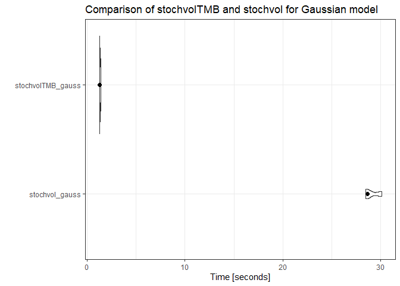
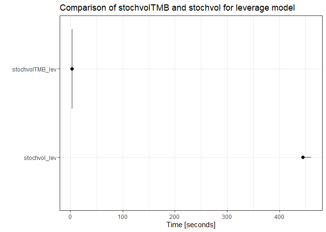

<!-- README.md is generated from README.Rmd. Please edit that file -->

# stochvolTMB

<!-- badges: start -->

[](https://www.tidyverse.org/lifecycle/#experimental)
[](https://www.gnu.org/licenses/gpl-3.0)
[](https://github.com/JensWahl/stochvolTMB/actions)
<!-- badges: end -->

`stochvolTMB` is a package for fitting stochastic volatility (SV) models
to time series data. It is inspired by the package
[stochvol](https://github.com/gregorkastner/stochvol), but parameter
estimates are obtained through optimization and not MCMC, leading to
significant speed up. It is built on [Template Model
Builder](https://github.com/kaskr/adcomp) for fast and efficient
estimation. The latent volatility is integrated out of the likelihood
using the Laplace approximation and automatic differentiation (AD) is
used for accurate evaluation of derivatives.

Four distributions for the observational error are implemented:

  - **Gaussian** - The classic SV model with Gaussian noise
  - **t** - t-distributed noise for heavy tail returns
  - **Leverage** - Extending the **Gaussian** model by allowing observed
    returns to be correlated with the latent volatility
  - **Skew-Gaussian** - Skew-Gaussian distributed noise for asymmetric
    returns

## Installation

You can install `stochvolTMB` from github by running

``` r
# install.packages("devtools")
devtools::install_github("JensWahl/stochvolTMB")
```

## Example

The main function for estimating parameters is `estimate_parameters`:

``` r
library(stochvolTMB, warn.conflicts = FALSE)

# load s&p500 data from 2005 to 2018
data(spy)

# find the best model using AIC 
AIC(estimate_parameters(spy$log_return, model = "gaussian", silent = TRUE),
    estimate_parameters(spy$log_return, model = "t", silent = TRUE),
    estimate_parameters(spy$log_return, model = "skew_gaussian", silent = TRUE),
    estimate_parameters(spy$log_return, model = "leverage", silent = TRUE))
#> [1] -23430.57

# The leverage model stand out with an AIC for below the other models
opt <- estimate_parameters(spy$log_return, model = "leverage", silent = TRUE)

# get parameter estimates with standard error
estimates <- summary(opt)
head(estimates, 10)
#>       parameter     estimate    std_error     z_value       p_value
#>  1: log_sigma_y -4.786880902 0.0499293705 -95.8730474  0.000000e+00
#>  2: log_sigma_h -1.296652044 0.0667927998 -19.4130512  5.986433e-84
#>  3:   phi_logit  4.110208379 0.1375465458  29.8823090 3.341130e-196
#>  4:   rho_logit -1.939946750 0.1467666528 -13.2178987  6.916940e-40
#>  5:     sigma_y  0.008338425 0.0004163323  20.0282918  3.121840e-89
#>  6:     sigma_h  0.273445746 0.0182642070  14.9716736  1.124552e-50
#>  7:         phi  0.967720808 0.0043682334 221.5359687  0.000000e+00
#>  8:         rho -0.748692587 0.0322489934 -23.2159986 3.138829e-119
#>  9:           h -0.536253306 0.5182212112  -1.0347961  3.007641e-01
#> 10:           h -0.207810839 0.4245275458  -0.4895108  6.244801e-01
#>            type
#>  1:       fixed
#>  2:       fixed
#>  3:       fixed
#>  4:       fixed
#>  5: transformed
#>  6: transformed
#>  7: transformed
#>  8: transformed
#>  9:      random
#> 10:      random

## plot estimated volatility with 95 % confidence interval
plot(opt, include_ci = TRUE)
```


## Comparison

An comparison of `stochvol` and `stochvolTMB` shows about a 20 times
speed up for the Gaussian model and 200 for the leverage model:

``` r
library(stochvol)
#> Warning: package 'stochvol' was built under R version 3.6.3
#> Loading required package: coda
#> Warning: package 'coda' was built under R version 3.6.1
library(stochvolTMB)
library(microbenchmark)
#> Warning: package 'microbenchmark' was built under R version 3.6.3
library(ggplot2)
#> Warning: package 'ggplot2' was built under R version 3.6.3

data(spy)

gaussian <- microbenchmark(
  stochvol_gauss = {svsample(spy$log_return, quiet = T)},
  stochvolTMB_gauss  = {estimate_parameters(spy$log_return, "gaussian", silent = TRUE)},
  times = 3L
)

leverage <- microbenchmark(
    stochvol_lev = {svlsample(spy$log_return, quiet = T)},
    stochvolTMB_lev  = {estimate_parameters(spy$log_return, "leverage", silent = TRUE)},
    times = 3L
)

gaussian
#> Unit: seconds
#>               expr       min       lq      mean    median        uq
#>     stochvol_gauss 28.482321 28.57319 29.078721 28.664051 29.376921
#>  stochvolTMB_gauss  1.258273  1.27137  1.318565  1.284466  1.348711
#>        max neval
#>  30.089791     3
#>   1.412956     3
autoplot(gaussian, log = FALSE) + stat_summary(fun = median, geom = 'point', size = 2) + ggtitle("Comparison of stochvolTMB and stochvol for Gaussian model")
#> Coordinate system already present. Adding new coordinate system, which will replace the existing one.
```



``` r
leverage
#> Unit: seconds
#>             expr        min         lq       mean     median        uq
#>     stochvol_lev 442.471718 443.570413 448.843639 444.669107 452.02960
#>  stochvolTMB_lev   2.282377   2.298566   2.327099   2.314756   2.34946
#>         max neval
#>  459.390092     3
#>    2.384165     3
autoplot(leverage, log = FALSE) + stat_summary(fun = median, geom = 'point', size = 2) + ggtitle("Comparison of stochvolTMB and stochvol for leverage model")
#> Coordinate system already present. Adding new coordinate system, which will replace the existing one.
```



## Shiny app

By running `demo()` you start a shiny application where you can visually
inspect the effect of choosing different models and parameter
configurations

``` r
demo()
```


