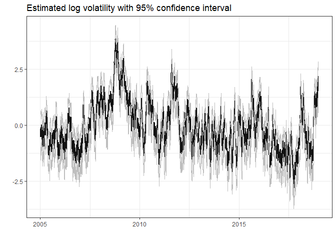

<!-- README.md is generated from README.Rmd. Please edit that file -->

# stochvolTMB

<!-- badges: start -->

[](https://cran.r-project.org/package=stochvolTMB)
[](https://r-pkg.org/pkg/stochvolTMB)
[](https://github.com/JensWahl/stochvolTMB/actions)
[](https://www.gnu.org/licenses/gpl-3.0)
[](https://lifecycle.r-lib.org/articles/stages.html)
[](https://zenodo.org/badge/latestdoi/162462958)
<!-- badges: end -->

`stochvolTMB` is a package for fitting stochastic volatility (SV) models
to time series data. It is inspired by the package
[stochvol](https://github.com/gregorkastner/stochvol), but parameter
estimates are obtained through optimization and not MCMC, leading to
significant speed up. It is built on [Template Model
Builder](https://github.com/kaskr/adcomp) for fast and efficient
estimation. The latent volatility is integrated out of the likelihood
using the Laplace approximation and automatic differentiation (AD) is
used for accurate evaluation of derivatives.

Four distributions for the observational error are implemented:

  - **Gaussian** - The classic SV model with Gaussian noise
  - **t** - t-distributed noise for heavy tail returns
  - **Leverage** - Extending the **Gaussian** model by allowing observed
    returns to be correlated with the latent volatility
  - **Skew-Gaussian** - Skew-Gaussian distributed noise for asymmetric
    returns

## Installation

To install the current stable release from CRAN, use

``` r
install.packages("stochvolTMB")
```

To install the current development version, use

``` r
# install.packages("remotes")
remotes::install_github("JensWahl/stochvolTMB")
```

If you would also like to build and view the vignette locally, use

``` r
remotes::install_github("JensWahl/stochvolTMB", dependencies = TRUE, build_vignettes = TRUE)
```

## Example

The main function for estimating parameters is `estimate_parameters`:

``` r
library(stochvolTMB, warn.conflicts = FALSE)

# load s&p500 data from 2005 to 2018
data(spy)

# find the best model using AIC 
gaussian <- estimate_parameters(spy$log_return, model = "gaussian", silent = TRUE)
t_dist <- estimate_parameters(spy$log_return, model = "t", silent = TRUE)
skew_gaussian <- estimate_parameters(spy$log_return, model = "skew_gaussian", silent = TRUE)
leverage <- estimate_parameters(spy$log_return, model = "leverage", silent = TRUE)

# the leverage model stands out with an AIC far below the other models
AIC(gaussian, t_dist, skew_gaussian, leverage)
#>               df       AIC
#> gaussian       3 -23430.57
#> t_dist         4 -23451.69
#> skew_gaussian  4 -23440.87
#> leverage       4 -23608.85

# get parameter estimates with standard error
estimates <- summary(leverage)
head(estimates, 10)
#>       parameter     estimate    std_error     z_value       p_value        type
#>  1:     sigma_y  0.008338412 0.0004163314  20.0283029  3.121144e-89 transformed
#>  2:     sigma_h  0.273443559 0.0182641070  14.9716359  1.125191e-50 transformed
#>  3:         phi  0.967721215 0.0043681868 221.5384240  0.000000e+00 transformed
#>  4:         rho -0.748695259 0.0322487815 -23.2162340 3.121690e-119 transformed
#>  5: log_sigma_y -4.786882463 0.0499293427 -95.8731319  0.000000e+00       fixed
#>  6: log_sigma_h -1.296660043 0.0667929683 -19.4131220  5.978190e-84       fixed
#>  7:   logit_phi  4.110221202 0.1375467861  29.8823500 3.337032e-196       fixed
#>  8:   logit_rho -1.939958912 0.1467670249 -13.2179481  6.912403e-40       fixed
#>  9:           h -0.536254072 0.5182192669  -1.0348015  3.007616e-01      random
#> 10:           h -0.207811236 0.4245258952  -0.4895137  6.244781e-01      random

# plot estimated volatility with 95 % confidence interval
plot(leverage, include_ci = TRUE, dates = spy$date)
```



Given the estimated parameters we can simulate future volatility and
log-returns using `predict`.

``` r
set.seed(123)
# simulate future prices with or without parameter uncertainty
pred = predict(leverage, steps = 10)

# Calculate the mean, 2.5% and 97.5% quantiles from the simulations
pred_summary = summary(pred, quantiles = c(0.025, 0.975), predict_mean = TRUE)

print(pred_summary)
#> $y
#>     time quantile_0.025 quantile_0.975          mean
#>  1:    1    -0.03787452     0.03639606 -2.352005e-04
#>  2:    2    -0.03750167     0.03718038  7.938422e-05
#>  3:    3    -0.03759011     0.03677040 -6.930858e-05
#>  4:    4    -0.03667977     0.03841486  2.810659e-04
#>  5:    5    -0.03674431     0.03679402 -1.421016e-04
#>  6:    6    -0.03531571     0.03708404  2.750826e-04
#>  7:    7    -0.03706161     0.03531337 -9.648350e-05
#>  8:    8    -0.03654679     0.03581507 -9.638224e-05
#>  9:    9    -0.03558469     0.03600052 -7.431832e-05
#> 10:   10    -0.03551163     0.03483791 -3.915279e-04
#> 
#> $h
#>     time quantile_0.025 quantile_0.975     mean
#>  1:    1     0.41447216       2.519873 1.455147
#>  2:    2     0.27225022       2.568749 1.408390
#>  3:    3     0.10808006       2.612277 1.363972
#>  4:    4     0.01248118       2.639010 1.322519
#>  5:    5    -0.12153490       2.658716 1.276073
#>  6:    6    -0.20817536       2.688433 1.239662
#>  7:    7    -0.28558724       2.696168 1.199534
#>  8:    8    -0.37711849       2.699062 1.160366
#>  9:    9    -0.46776638       2.718274 1.124317
#> 10:   10    -0.55249774       2.705546 1.086525
#> 
#> $h_exp
#>     time quantile_0.025 quantile_0.975       mean
#>  1:    1    0.010125271     0.02945742 0.01790539
#>  2:    2    0.009421133     0.03039987 0.01765869
#>  3:    3    0.008772480     0.03099832 0.01736513
#>  4:    4    0.008319762     0.03130376 0.01715038
#>  5:    5    0.007848844     0.03163646 0.01677779
#>  6:    6    0.007459083     0.03191093 0.01657714
#>  7:    7    0.007125009     0.03202311 0.01631264
#>  8:    8    0.006833992     0.03228772 0.01612161
#>  9:    9    0.006592298     0.03264210 0.01588995
#> 10:   10    0.006231481     0.03240400 0.01567428

# plot predicted volatility with 0.025 and 0.975 quantiles
plot(leverage, include_ci = TRUE, forecast = 50, dates = spy$d) +
  ggplot2::xlim(c(spy[.N, date] - 150, spy[.N, date] + 50))
#> Warning: Removed 3419 row(s) containing missing values (geom_path).

#> Warning: Removed 3419 row(s) containing missing values (geom_path).

#> Warning: Removed 3419 row(s) containing missing values (geom_path).
```


## Shiny app

By running `demo()` you start a shiny application where you can visually
inspect the effect of choosing different models and parameter
configurations

``` r
demo()
```


